# Mermaid Diagrams in Obsidian

Obsidian renders Mermaid natively in fenced code blocks. The syntax is:
````markdown
```mermaid
[diagram type]
    [content]
```
````

---

## Flow & Process Diagrams

### Flowchart
````markdown
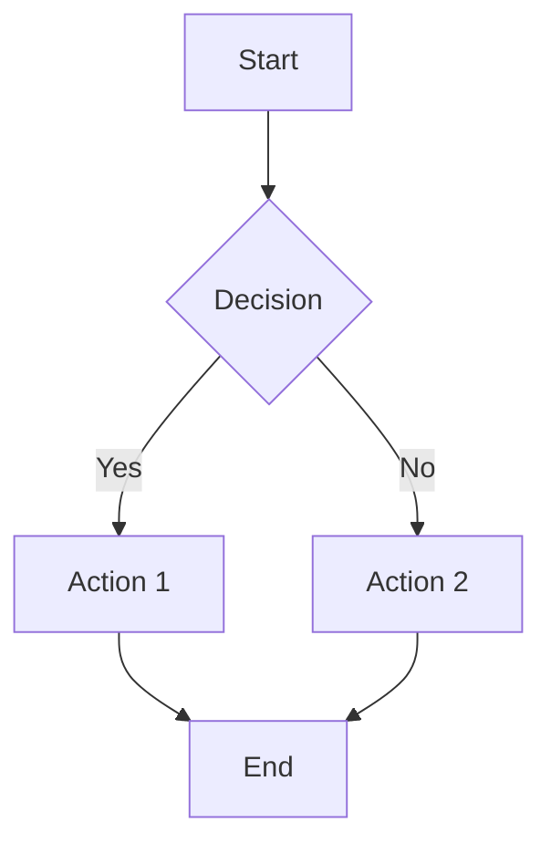
````

**Directions**: `TD` (top-down), `LR` (left-right), `BT` (bottom-top), `RL` (right-left)

**Node Shapes**:
```
[Square]       (Round)        {Diamond}
[[Subroutine]] [(Cylinder)]   ((Circle))
>Asymmetric]   {{{Hexagon}}}  [/Parallelogram/]
[\Trapezoid\]
```

### Sequence Diagram
````markdown
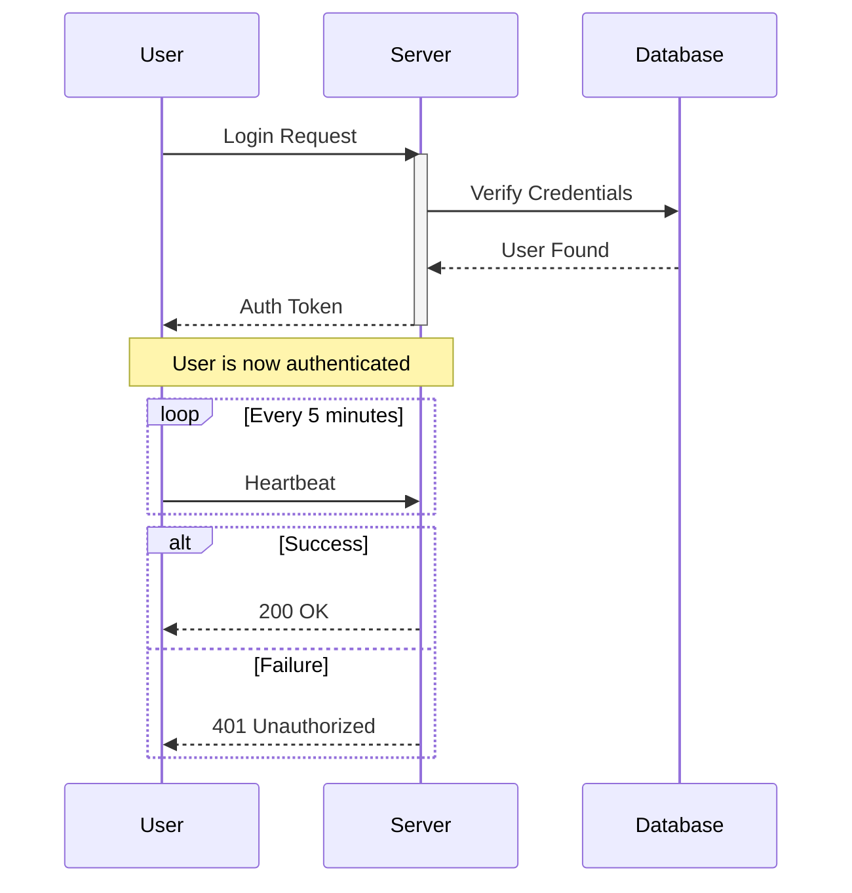
````

**Arrow Types**: `->>` (solid), `-->>` (dotted), `-x` (cross), `-)` (async)

### State Diagram
````markdown
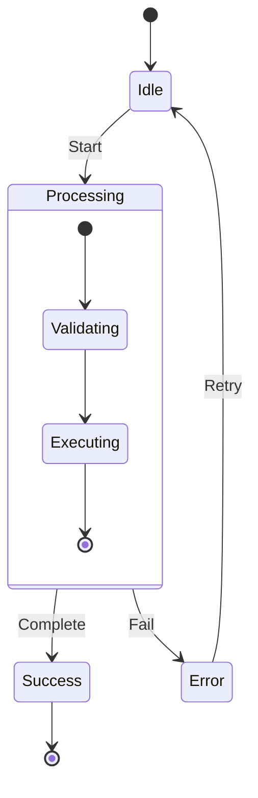
````

### User Journey
````markdown
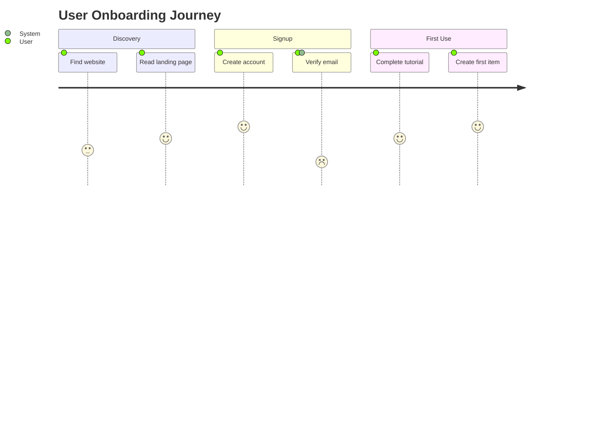
````

---

## Data & Metrics Diagrams

### Pie Chart
````markdown
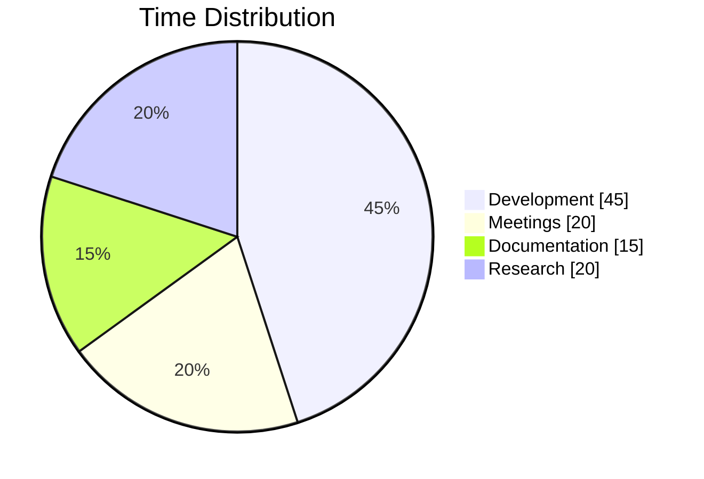
````

### XY Chart
````markdown
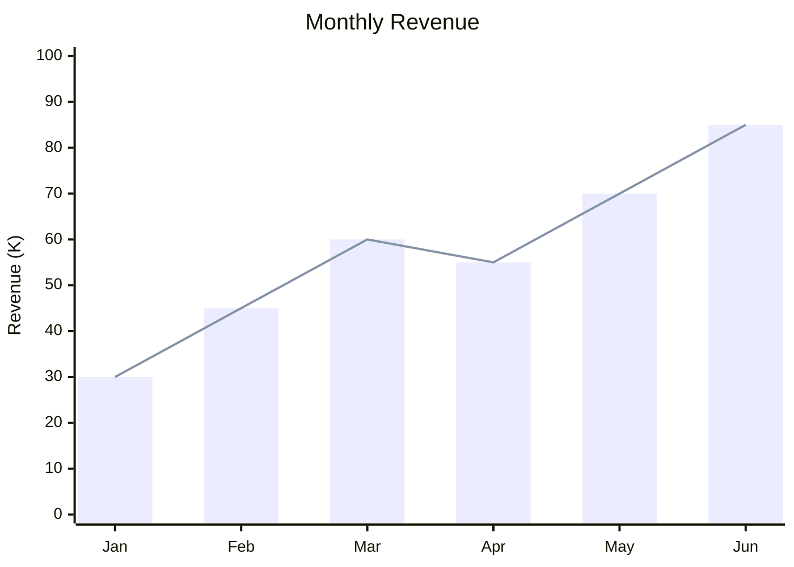
````

### Quadrant Chart
````markdown
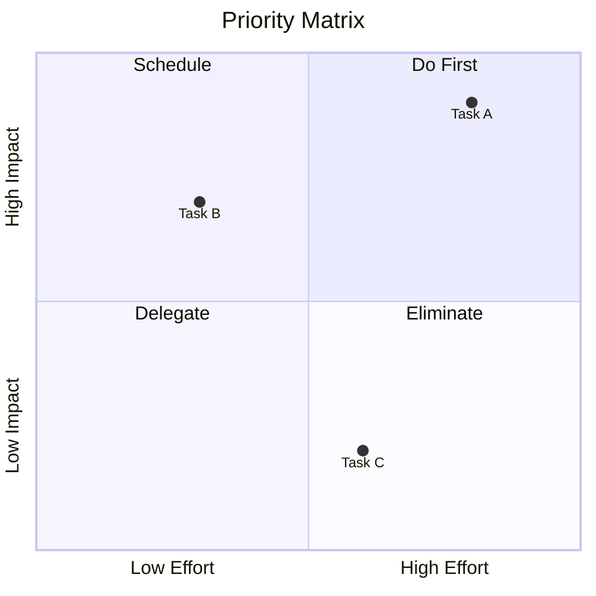
````

### Sankey Diagram
````markdown
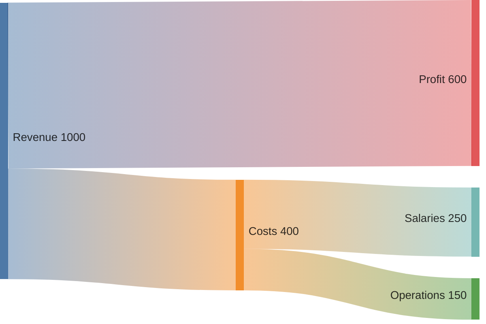
````

---

## Architecture & Design Diagrams

### Class Diagram
````markdown
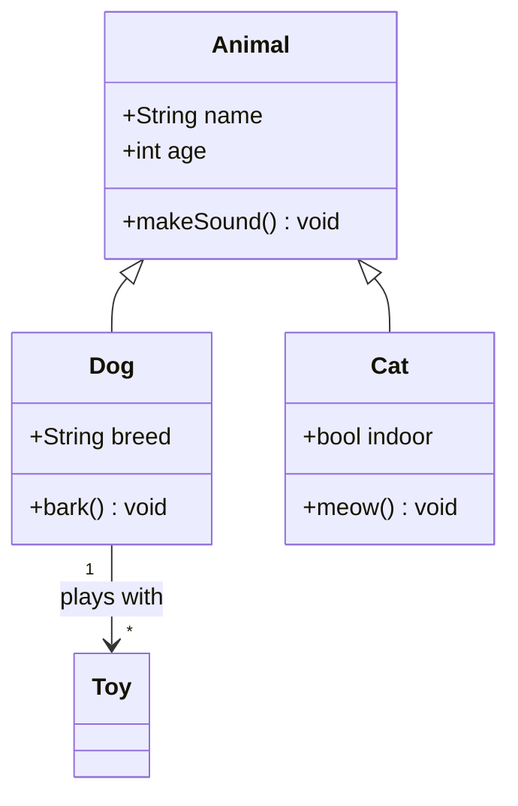
````

**Relationships**: `<|--` (inheritance), `*--` (composition), `o--` (aggregation), `-->` (association), `..>` (dependency)

### Entity-Relationship Diagram
````markdown
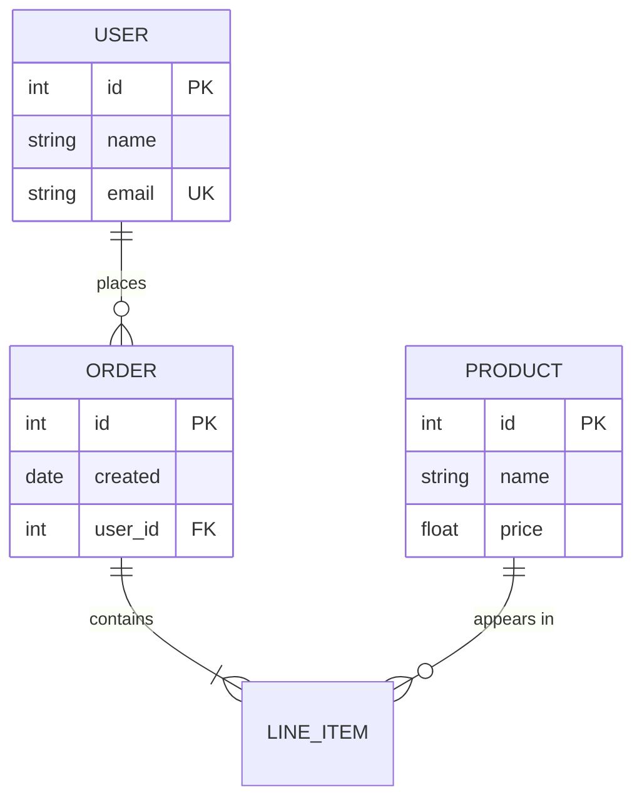
````

**Cardinality**: `||` (exactly one), `o|` (zero or one), `}|` (one or more), `}o` (zero or more)

### C4 Context Diagram
````markdown
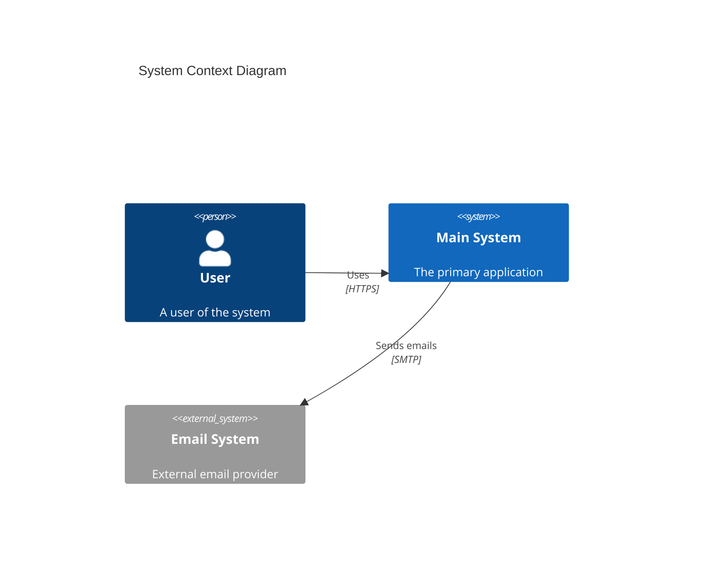
````

### Block Diagram
````markdown
```mermaid
block-beta
    columns 3

    Frontend:3
    block:backend:2
        API
        DB[(Database)]
    end
    Cache

    Frontend --> API
    API --> DB
    API --> Cache
```
````

---

## Planning & Organization Diagrams

### Gantt Chart
````markdown
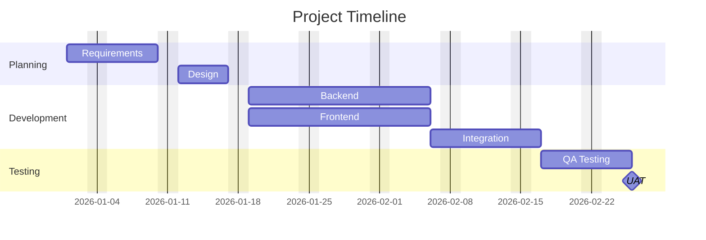
````

### Timeline
````markdown
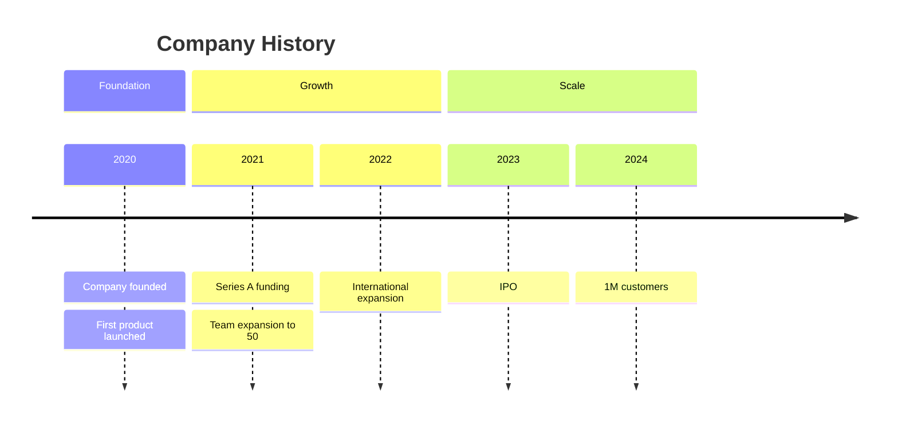
````

### Mindmap
````markdown
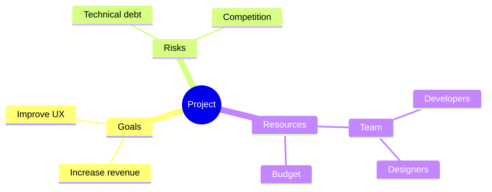
````

### Git Graph
````markdown
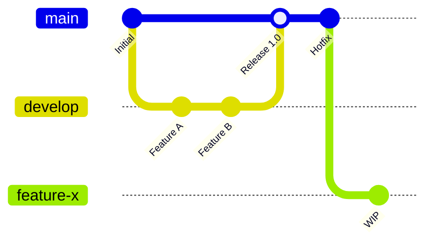
````

---

## Mermaid Styling & Theming

### Built-in Themes
```mermaid
%%{init: {'theme': 'dark'}}%%
```
Available: `default`, `dark`, `forest`, `neutral`, `base`

### Custom Styling with classDef
````markdown
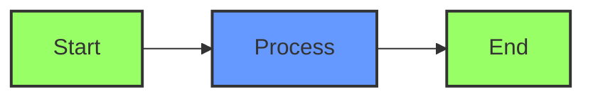
````

### Inline Styling
````markdown
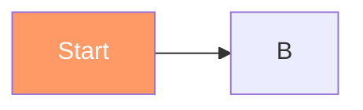
````

---

## Diagram Selection Guide

| Diagram | Best For |
|---------|----------|
| **Flowchart** | Decisions, processes, workflows, algorithms |
| **Sequence** | API calls, interactions, protocols |
| **State** | Lifecycles, status transitions |
| **User Journey** | UX flows, customer experience |
| **Pie** | Proportions, distributions |
| **XY Chart** | Trends, comparisons over time |
| **Quadrant** | Priority matrices, 2x2 analysis |
| **Sankey** | Flow quantities, resource distribution |
| **Class** | Object-oriented design, data models |
| **ER** | Database schemas, relationships |
| **C4** | System architecture, contexts |
| **Block** | Component layouts, infrastructure |
| **Gantt** | Project schedules, timelines |
| **Timeline** | History, milestones, events |
| **Mindmap** | Brainstorming, topic exploration |
| **Git** | Branch strategies, version history |
