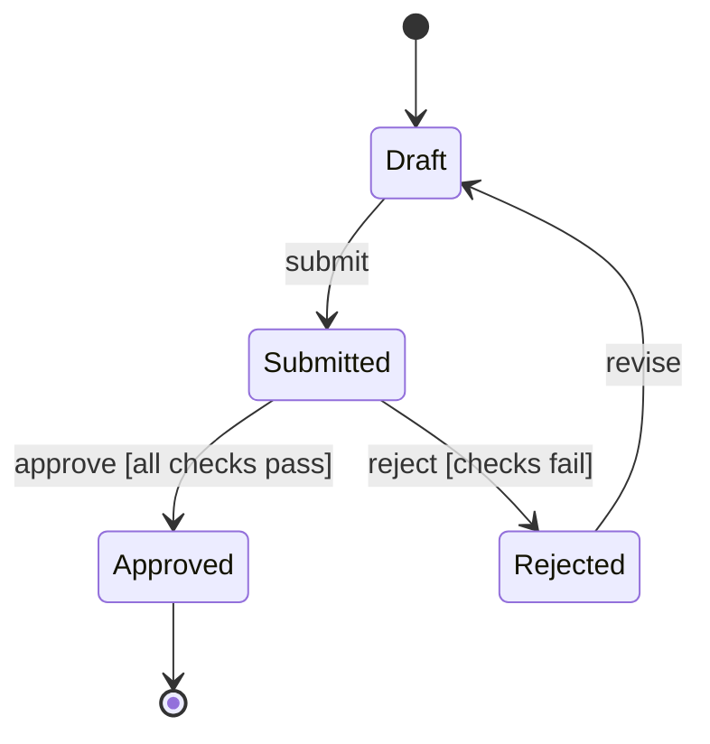
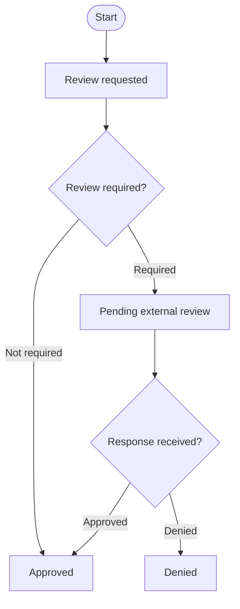
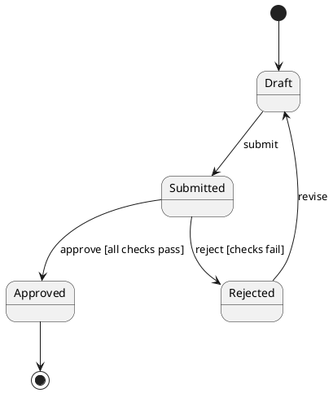

# Output Backends

Choose output syntax after the model is clear.

## Backend Selection

| Backend | Use When | Avoid When |
|---|---|---|
| Mermaid `stateDiagram-v2` | True state machines, status lifecycles, simple hierarchy | You need visible decision diamonds, lanes, or process ownership |
| Mermaid `flowchart` | Decision-heavy maps, workflows, ownership, current vs planned scope | You need formal statechart semantics or nested states |
| PlantUML state diagram | UML-flavored state diagrams or when PlantUML rendering is the target | The destination only supports Mermaid |
| Transition table | Dense or review-critical transitions | The user needs only a quick visual overview |
| XState-style sketch | The user is implementing a state machine in JavaScript/TypeScript | The task is only documentation |

## Mermaid State Diagram Rules

Use `stateDiagram-v2` for true state machines.

Rules:

- Keep state names short and noun-like.
- Use transition labels as `event [guard] / action` only when that detail is useful.
- Use `<<choice>>` for conditional branches that would otherwise hide decision logic.
- Use composite states only when child states share parent behavior.
- Add a transition table when guards or actions are important.

## Mermaid Flowchart Rules

Use `flowchart` when gates, ownership, or actions are central.

Rules:

- Use `{Decision?}` for gates.
- Label every outgoing decision branch.
- Keep durable states in boxes and actions on arrows or action boxes.
- Use subgraphs for ownership lanes only when ownership is a primary question.
- Avoid relying on `linkStyle` indexes for semantic meaning; they drift after edits.

## PlantUML State Diagram Rules

Use PlantUML when UML notation is requested or expected.

Rules:

- Preserve the same model as Mermaid output.
- Use guards in square brackets.
- Use composite states for nested behavior when needed.
- Do not invent UML details when the source material does not specify them.

## Transition Table Rules

Use a transition table when exactness matters.

| From | Event | Guard | Action | To |
|---|---|---|---|---|
| Draft | submit | valid order | create submission | Submitted |
| Submitted | approve | all checks pass | notify owner | Approved |

Rules:

- Include one row per transition.
- Leave `Guard` blank only when the transition is unconditional.
- Keep `Action` separate from `To`.
- Use the table to verify every diagram edge.

## Render-Safe Mermaid Syntax

- Prefer simple node ids: `PendingReview`, `ReviewGate`, `CallbackReceived`.
- Put display text in brackets; keep ids stable.
- Keep labels short; move long explanations to a legend or table.
- Avoid escaped newlines, quotes inside labels, dollar signs, and punctuation-heavy text.
- Use ` ` sparingly if line breaks are required by the target renderer.
- Re-render after adding or removing edges.
